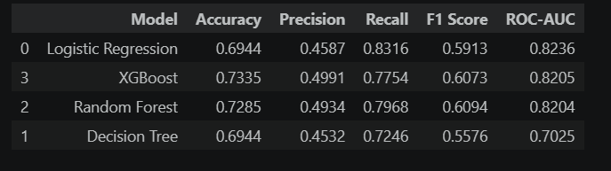
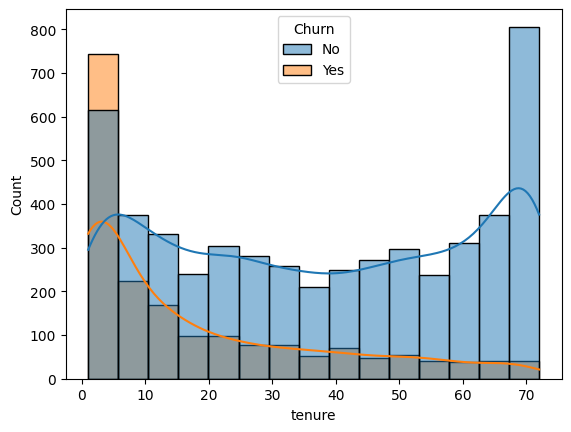
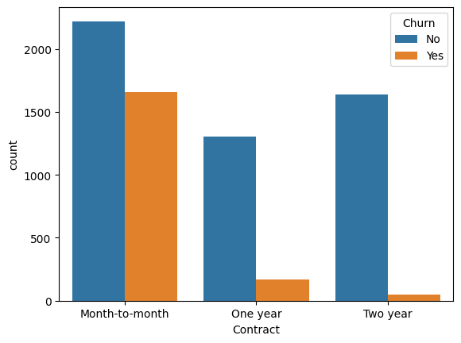
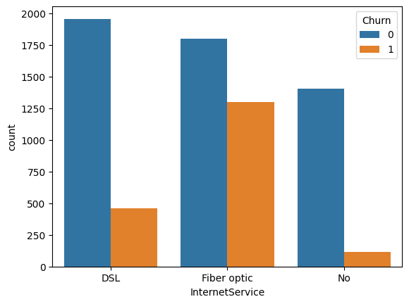
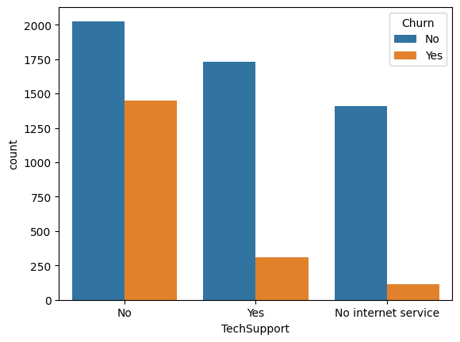
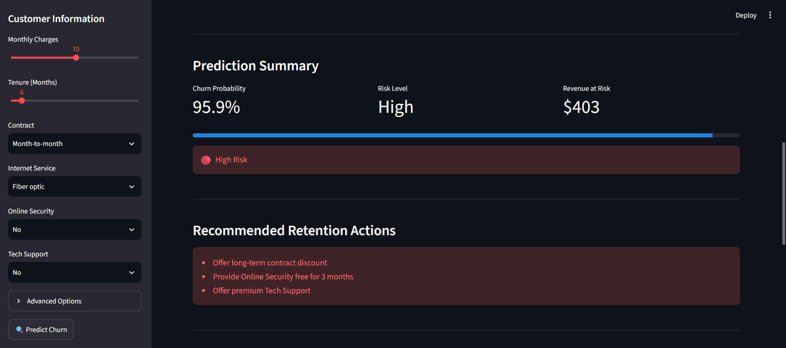
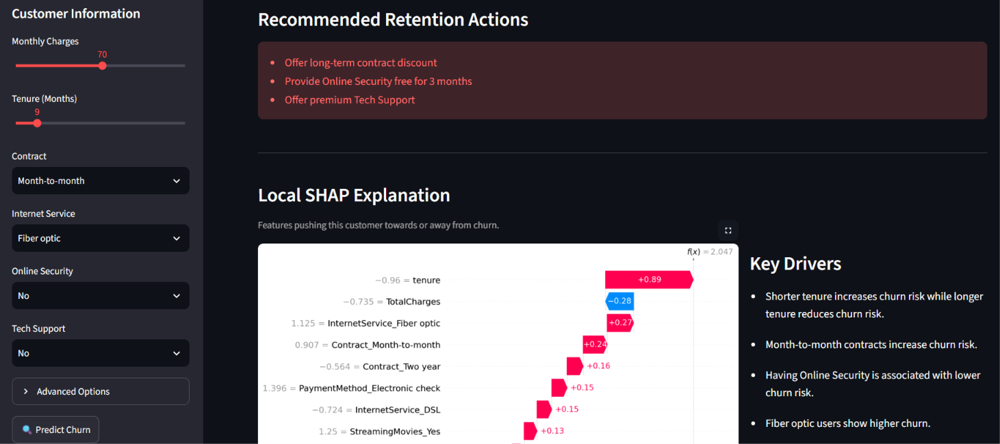
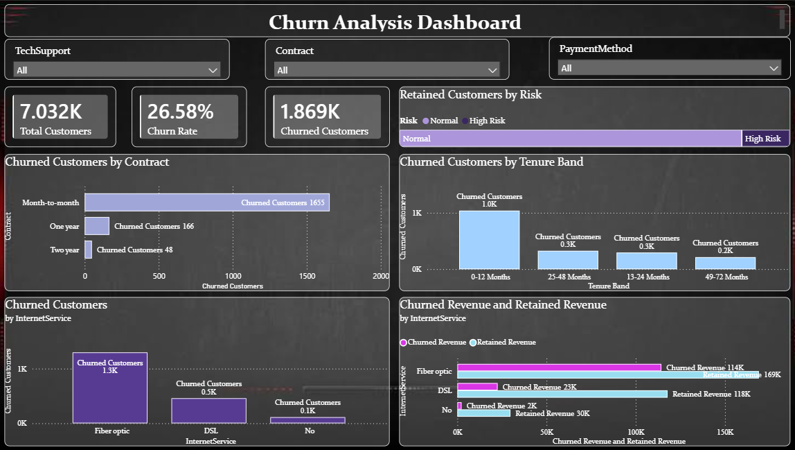

# Customer Churn Prediction using Machine Learning

## Project Overview

Customer churn is one of the biggest challenges for subscription-based businesses. This project predicts whether a customer is likely to leave the company and explains each prediction using SHAP (Explainable AI). A Power BI dashboard provides business insights, while a Streamlit web application enables interactive predictions.

### Live Demo App: https://customer-churn-prediction-gravionic.streamlit.app/
---

## Business Problem

Retaining existing customers is significantly more cost-effective than acquiring new ones. This project helps businesses:

- Predict customers at risk of churn
- Understand the factors driving churn
- Support data-driven customer retention strategies

---
## Project Structure

```text
customer-churn-prediction/
│
├── app
│
├── assets
│
├── data
│
├── images
│
├── models
│
├── notebooks
│
├── README.md
│
└── requirements
```
---

## Dataset

- **Source:** Telco Customer Churn Dataset (https://www.kaggle.com/datasets/blastchar/telco-customer-churn)

---

## Installations


### Clone the repository

```bash
git clone https://github.com/gravionic/customer-churn-prediction.git
cd customer-churn-prediction
```

### Technologies

`Python` `Pandas` `NumPy` `Scikit-learn` `Streamlit` `Matplotlib` `Joblib` `imbalanced-learn` `shap`

```bash
pip install -r requirements.txt
```

---

## Machine Learning Pipeline

- Data Cleaning
- Feature Engineering
- One-Hot Encoding
- Feature Scaling
- Model Training
- Hyperparameter Tuning
- Model Evaluation
- SHAP Explainability
- Model Deployment using Streamlit

---

## Models Evaluated

- Logistic Regression
- Decision Tree
- Random Forest
- XGBoost


---
## Final Model Selection

Logistic Regression was selected as the final model based on the project's primary objective of identifying potential churners.

| Metric | Logistic Regression |
|---------|--------------:|
| Accuracy | 73.13% |
| Precision | 49.66% |
| Recall | 77.54% |
| F1 Score | 60.54% |
| ROC-AUC | 0.8328 |

Although XGBoost achieved the highest ROC-AUC (0.8331), Logistic Regression achieved substantially higher recall (0.7754) while maintaining an almost identical ROC-AUC (0.8328). Since the project prioritizes minimizing false negatives and identifying as many potential churners as possible, Logistic Regression was selected.

---

### Final Calibrated Model

The selected Logistic Regression model was calibrated using sigmoid calibration to improve the reliability of its predicted churn probabilities.

- **ROC-AUC:** 83.28%
- **Brier Score:** 0.1410
- **Classification threshold:** 30%
- **Churn recall at selected threshold:** 76%

The 30% classification threshold was selected to prioritize identifying potential churners.

---

## Key Findings

The SHAP analysis identified the strongest drivers of customer churn:

- Short customer tenure
- Month-to-month contracts
- No Online Security
- Fiber optic internet service
- No Tech Support

Customers with longer contracts, longer tenure, and additional security services were considerably less likely to churn.

## Supporting Visualizations









---

## Streamlit Web Application

The application allows users to:

- Enter customer information
- Predict churn probability
- View customer risk level
- Get retention recommendations
- Understand predictions through SHAP Explainable AI



---

## Power BI Dashboard

The dashboard provides business insights including:

- Customer distribution
- Churn rate
- Revenue analysis
- Contract type analysis
- Payment method analysis
- Customer demographics
- Churn by tenure



---

## Future Improvements

- Deploy the application to Streamlit Community Cloud
- Add LLM-based retention recommendations
- Integrate customer database support
- Add batch prediction functionality

---

## Author

Mohit
